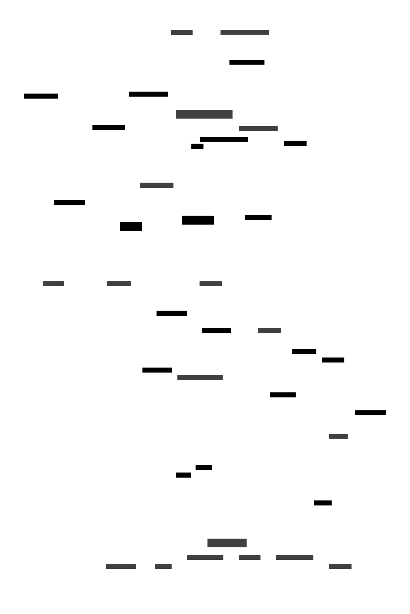

# Diagrams: Graphviz, Mermaid & D2

This directory contains diagrams for the Narrow AI Matchmaker project using:
*   [Graphviz](https://graphviz.org/) (DOT language) for static architecture and data models (`.dot` files).
*   [Mermaid](https://mermaid.js.org/) for sequence diagrams (`.mmd` files).
*   [D2](https://d2lang.com/) for various diagrams, often with better layout (`.d2` files).

## Graphviz Diagrams (.dot files)

### Graphviz Installation

Graphviz is required to render the `.dot` files.

```bash
# Install Graphviz (macOS)
brew install graphviz

# Install Graphviz (Debian/Ubuntu)
sudo apt-get update && sudo apt-get install graphviz
```

Check the [official Graphviz download page](https://graphviz.org/download/) for other operating systems.

### Rendering Graphviz

Use the `dot` command to render diagrams. Example:

```bash
# Render a DOT file to SVG
dot -Tsvg -o compiled/some_diagram.svg some_diagram.dot
```

## Mermaid Sequence Diagrams (.mmd files)

Sequence diagrams are defined using Mermaid syntax in `.mmd` files.

### Mermaid CLI Installation (mmdc)

The Mermaid CLI (`mmdc`) is needed to render `.mmd` files from the command line. It requires Node.js and npm.

1.  **Install Node.js:** If you don't have it, download from [https://nodejs.org/](https://nodejs.org/) (LTS recommended).
2.  **Install mmdc:**
    ```bash
    npm install -g @mermaid-js/mermaid-cli
    # or: sudo npm install -g @mermaid-js/mermaid-cli
    ```
3.  **Verify:**
    ```bash
    mmdc --version
    ```

### Rendering Mermaid

Use the `mmdc` command:

```bash
# Render async upload sequence to SVG
mmdc -i sequence_option1_async_upload.mmd -o compiled/sequence_option1_async_upload.svg
```

## D2 Diagrams (.d2 files)

D2 is a modern diagram scripting language that aims to produce better layouts automatically.

### D2 Installation

The D2 CLI is required to render `.d2` files.

```bash
# Install D2 via script (Linux/macOS - recommended)
curl -fsSL https://d2lang.com/install.sh | sh -s -- --version latest

# Install D2 (macOS via Homebrew)
brew install d2
```

Check the [official D2 installation guide](https://d2lang.com/tour/install) for other OS/methods.

### Rendering D2

Use the `d2` command:

```bash
# Render a D2 file to SVG
d2 docs/diagrams/backend_services.d2 docs/diagrams/compiled/backend_services.svg

# Render with a specific theme (e.g., Terminal theme)
d2 -t 8 docs/diagrams/backend_services.d2 docs/diagrams/compiled/backend_services_terminal.svg
```

## Automatic Compilation (Watching for Changes)

To automatically recompile diagrams whenever you save changes to a `.dot`, `.mmd`, or `.d2` file, you can use the `watch_diagrams.sh` script. This script requires `fswatch`.

### fswatch Installation

```bash
# Install fswatch (macOS)
brew install fswatch

# Install fswatch (Debian/Ubuntu)
sudo apt-get update && sudo apt-get install fswatch
```

### Running the Watcher

1.  Make sure both scripts are executable:
    ```bash
    chmod +x compile_diagrams.sh
    chmod +x watch_diagrams.sh
    ```
2.  Run the watch script from the project root:
    ```bash
    ./docs/diagrams/watch_diagrams.sh
    ```
    This will monitor the `docs/diagrams` directory and run `compile_diagrams.sh` for the specific file that was changed. Press `Ctrl+C` to stop the watcher.

## Diagram Types

### Graphviz (.dot)

Used for static architecture and data models.

*   `system_components.dot`: High-level system architecture.
*   `conceptual_data_model.dot`: Conceptual data model.
*   `aws_infrastructure.dot`: AWS infrastructure overview.
*   `backend_services_dot.dot`: Backend service interactions (alternative rendering).

### Mermaid (.mmd)

Used for sequence diagrams and potentially other dynamic flows.

*   `sequence_onboarding.mmd`: User onboarding flow.
*   `sequence_join_event.mmd`: Flow for joining an existing event.
*   `sequence_get_matches.mmd`: Flow for retrieving matches.
*   `onboarding_flow_highlevel.mmd`: Simplified onboarding overview.

### D2 (.d2)

*   `backend_services.d2`: Backend service interactions (often preferred layout).

## GitHub Integration

*   **Graphviz (.dot):** Pre-render `.dot` files to SVG/PNG (e.g., using the `compile_diagrams.sh` script) and commit the images in the `compiled/` directory. Reference the compiled image in Markdown.
    ```markdown
    
    ```
*   **Mermaid (.mmd):** Pre-render `.mmd` files to SVG/PNG (e.g., using the `compile_diagrams.sh` script) and commit the images in the `compiled/` directory. Reference the compiled image in Markdown.
    ```markdown
    
    ```
    Alternatively, for viewing directly on platforms supporting it, you can paste the `.mmd` content into a Markdown file within a ` ```mermaid ... ``` ` block, but pre-rendering ensures compatibility everywhere.
*   **D2 (.d2):** Pre-render `.d2` files to SVG/PNG (using `compile_diagrams.sh`) and commit the images in the `compiled/` directory. Reference the compiled image in Markdown.
    ```markdown
    
    ``` 