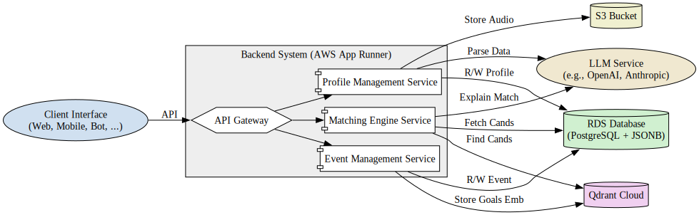
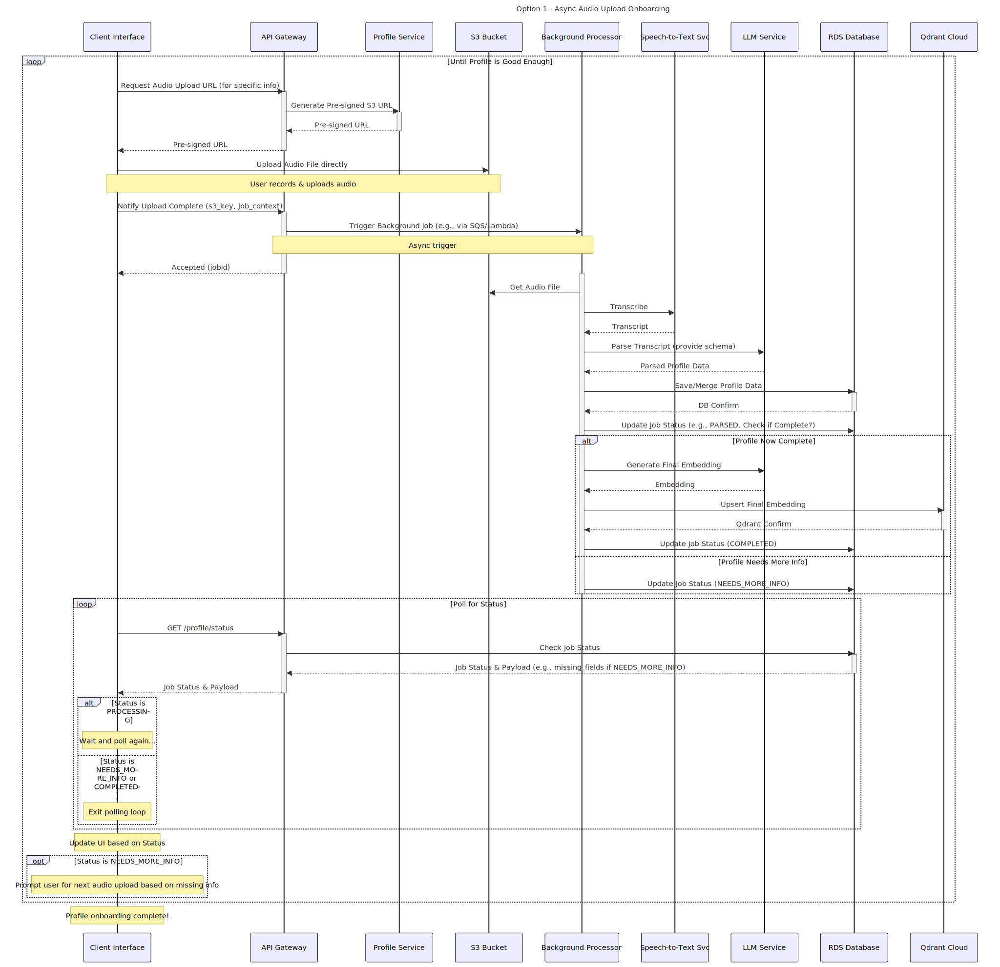

# Diagrams: Graphviz & Mermaid

This directory contains diagrams for the Narrow AI Matchmaker project using:
*   [Graphviz](https://graphviz.org/) (DOT language) for static architecture and data models (`.dot` files).
*   [Mermaid](https://mermaid.js.org/) for sequence diagrams (`.mmd` files).

## Graphviz Diagrams (.dot files)

### Graphviz Installation

Graphviz is required to render the `.dot` files.

```bash
# Install Graphviz (macOS)
brew install graphviz

# Install Graphviz (Debian/Ubuntu)
sudo apt-get update && sudo apt-get install graphviz
```

Check the [official Graphviz download page](https://graphviz.org/download/) for other operating systems.

### Rendering Graphviz

Use the `dot` command to render diagrams. Example:

```bash
# Render system components to SVG
dot -Tsvg -o compiled/system_components.svg system_components.dot
```

## Mermaid Sequence Diagrams (.mmd files)

Sequence diagrams are defined using Mermaid syntax in `.mmd` files.

### Mermaid CLI Installation (mmdc)

The Mermaid CLI (`mmdc`) is needed to render `.mmd` files from the command line. It requires Node.js and npm.

1.  **Install Node.js:** If you don't have it, download from [https://nodejs.org/](https://nodejs.org/) (LTS recommended).
2.  **Install mmdc:**
    ```bash
    npm install -g @mermaid-js/mermaid-cli
    # or: sudo npm install -g @mermaid-js/mermaid-cli
    ```
3.  **Verify:**
    ```bash
    mmdc --version
    ```

### Rendering Mermaid

Use the `mmdc` command:

```bash
# Render async upload sequence to SVG
mmdc -i sequence_option1_async_upload.mmd -o compiled/sequence_option1_async_upload.svg
```

## Diagram Types

*   **Graphviz (.dot):**
    *   System architecture (`system_components.dot`)
    *   Conceptual data model (`conceptual_data_model.dot`)
    *   AWS Infrastructure (`aws_infrastructure.dot`)
*   **Mermaid (.mmd):**
    *   Async Audio Upload Sequence (`sequence_option1_async_upload.mmd`)
    *   Real-time Conversation Sequence (`sequence_option2_realtime_convo.mmd`)
    *   Get Matches Sequence (`sequence_get_matches.mmd`) # Assumes .md was renamed
    *   Join Event Sequence (`sequence_join_event.mmd`)   # Assumes .md was renamed

## GitHub Integration

*   **Graphviz (.dot):** Pre-render `.dot` files to SVG/PNG (e.g., using the `compile_diagrams.sh` script) and commit the images in the `compiled/` directory. Reference the compiled image in Markdown.
    ```markdown
    
    ```
*   **Mermaid (.mmd):** Pre-render `.mmd` files to SVG/PNG (e.g., using the `compile_diagrams.sh` script) and commit the images in the `compiled/` directory. Reference the compiled image in Markdown.
    ```markdown
    
    ```
    Alternatively, for viewing directly on platforms supporting it, you can paste the `.mmd` content into a Markdown file within a ` ```mermaid ... ``` ` block, but pre-rendering ensures compatibility everywhere. 