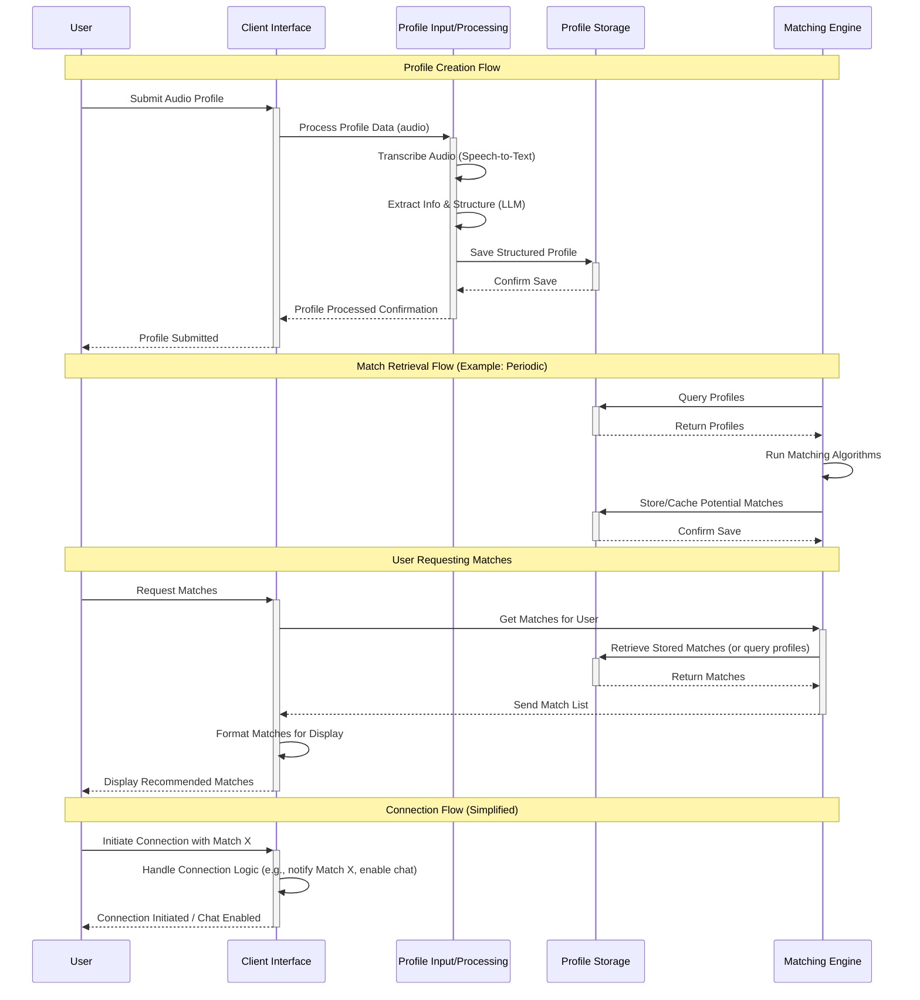

# Technical Overview: Narrow AI Matchmaker

## 1. Goal

This document outlines the high-level technical architecture and design considerations for the Narrow AI Matchmaker platform.

## 2. High-Level Architecture

The system is envisioned as a set of interacting modules:

*   **Profile Storage:** A persistent store for user profile data. This might involve a combination of databases (e.g., relational for structured data, vector DB for embeddings).
*   **Profile Input/Processing:** Handles the ingestion of user data (initially audio, potentially text, etc.), including transcription (Speech-to-Text) and information extraction/structuring (LLMs).
*   **Matching Engine:** Core logic for comparing profiles and identifying potential matches. This module interacts heavily with Profile Storage and likely uses ML/LLM techniques.
*   **Client Interface:** Provides endpoints for profile creation/management, retrieves match suggestions, and facilitates user interaction (e.g., viewing matches, initiating contact). This could be a web app, mobile app interface, or potentially API-driven for integration.

## 3. Module Interaction Flow

**Conceptual Flow:**

1.  User submits data (e.g., audio recording) via the **Client Interface**.
2.  The **Client Interface** sends the data to the **Profile Input/Processing** module.
3.  **Profile Input/Processing** transcribes audio, uses LLMs to extract key information, and structures the data.
4.  The processed profile data is saved in **Profile Storage**.
5.  The **Matching Engine** periodically (or triggered by new profiles) queries **Profile Storage** to find potential matches based on its algorithms.
6.  Identified matches are stored (potentially back in **Profile Storage** or a dedicated cache).
7.  Users request matches via the **Client Interface**, which queries the **Matching Engine** or the stored match results.
8.  The **Client Interface** displays matches and handles connection requests. 